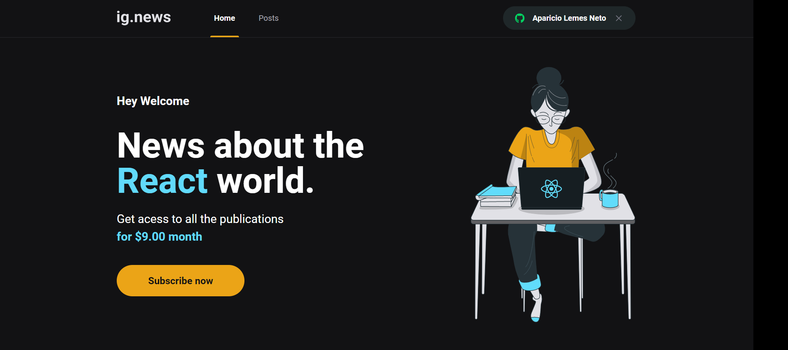

**Ignews**
- Criação de uma pagina de assinatura de conteudos.

**Rodar o projeto**

Ao clonar o projeto abra o terminal e execute os seguintes comandos:

`npm install`

`npm run dev`

**Funcionalidades**

- Adicionar um novo produto ao carrinho;
- Remover um produto do carrinho;
- Alterar a quantidade de um produto no carrinho;
- Cálculo dos preços sub-total e total do carrinho;
- Validação de estoque;
- Exibição de mensagens de erro;
- Entre outros.

**O que foi utilizado no desenvolvimento deste projeto?**

- Next.js
- Typescript
- CSS Modules
- API Routes
- SSG (Static Site Generation)
- SSR (Server Side Rendering)
- Next Auth com Github

 
## Showcase

##### Home

